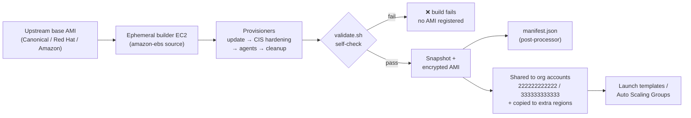

# 🛡️ packer-golden-images-cis

[](https://www.packer.io/)
[](https://aws.amazon.com/ec2/)
[](https://www.cisecurity.org/cis-benchmarks)
[](.github/workflows/packer-ci.yml)
[](LICENSE)

> Packer templates that bake **CIS-hardened golden AMIs** for Ubuntu 24.04, RHEL 9, Amazon Linux 2023, and Windows Server 2022/2025 — encrypted, agent-equipped, and ready to share across an AWS organization.

---

## 🏗️ Image Bakery Pipeline



The same flow runs unattended in CI for `packer fmt`/`validate`, and on demand
(or on a schedule) for the actual `packer build`.

---

## ✨ Features

- **Five operating systems, one codebase** — Ubuntu 24.04, RHEL 9, Amazon Linux 2023, Windows Server 2022 & 2025, each as an `amazon-ebs` source sharing a common provisioner chain.
- **CIS-aligned hardening** — SSH/auth policy, kernel & network `sysctl`, filesystem mount options, `auditd` rules, service disabling, host firewall, MAC (AppArmor/SELinux) for Linux; password/lockout policy, SMBv1/legacy-TLS removal, UAC, firewall, audit policy and RDP NLA for Windows.
- **Two CIS profiles** — `level1_server` (default) and a stricter `level2_server`, switched with a single variable.
- **Built-in validation gate** — an in-image `validate.sh` self-check fails the build before any AMI is registered if a core control is missing.
- **Operational agents baked in** — SSM Agent + CloudWatch Agent (with a baseline config) on every image.
- **Encrypted & shareable** — encrypted root volumes (default or custom KMS key), automatic sharing to other org accounts, and multi-region copy.
- **Reproducible & traceable** — timestamped AMI names, consistent tagging, and a `manifest.json` per build family via the manifest post-processor.
- **CI included** — GitHub Actions matrix runs `packer fmt -check` + `packer validate` per OS (no AWS credentials needed) plus `shellcheck`.

---

## 🗂️ Repository Structure

```text
packer-golden-images-cis/
├── plugins.pkr.hcl            # required_plugins (amazon >= 1.3)
├── variables.pkr.hcl          # input variables (placeholders only)
├── sources.pkr.hcl            # amazon-ebs source per OS
├── build.pkr.hcl              # build blocks: sources + provisioners + manifest
├── example.pkrvars.hcl        # sample var-file (account 111111111111, region us-east-1)
├── Makefile                   # init / fmt / validate / build / per-OS targets
├── packer-build.sh            # validate+build wrapper with var-file & -only
│
├── scripts/                   # shared Linux provisioners
│   ├── update.sh              # patch base OS
│   ├── cis-hardening.sh       # CIS controls (level1/level2)
│   ├── install-agents.sh      # SSM + CloudWatch agents
│   ├── validate.sh            # in-image hardening self-check (build gate)
│   └── cleanup.sh             # logs / host keys / machine-id / history
│
├── ubuntu/        scripts/extra-hardening.sh   + README.md
├── rhel/          scripts/extra-hardening.sh   + README.md
├── amazon-linux/  scripts/extra-hardening.sh   + README.md
├── windows/       scripts/{bootstrap-winrm,cis-hardening,install-agents,sysprep}.ps1 + README.md
│
├── manifests/                 # build output (gitignored, keeps .gitkeep)
├── .github/workflows/packer-ci.yml
├── .gitignore
└── LICENSE                    # MIT — Muhammad Imad
```

---

## 🚀 Usage

### Prerequisites

- [Packer](https://developer.hashicorp.com/packer/install) **>= 1.9**
- AWS credentials with permission to run EC2 instances and register AMIs
  (only required for `build`, **not** for `validate`)

### Quick start

```bash
# 1. Install the Amazon plugin
make init            # == packer init .

# 2. Check formatting and validate every OS against the sample var-file
make fmt-check
make validate

# 3. Build everything (uses example.pkrvars.hcl by default)
make build

# Build a single OS
make ubuntu                       # Ubuntu 24.04 only
make windows                      # both Windows images

# Target one source explicitly with your own var-file
ONLY=amazon-ebs.rhel VAR_FILE=prod.pkrvars.hcl make build
```

### Using the wrapper script

```bash
./packer-build.sh validate
./packer-build.sh build amazon-ebs.amazon_linux prod.pkrvars.hcl
```

### Switching CIS profile

```bash
# In your var-file:
cis_profile = "level2_server"
```

> Copy `example.pkrvars.hcl` to a non-committed file (e.g. `prod.pkrvars.hcl` —
> already in `.gitignore`) before putting real account IDs, KMS keys or regions
> in it.

---

## 🛡️ CIS Hardening

The hardening scripts apply a representative, well-documented subset of the
relevant **CIS Benchmarks**. Highlights:

### Linux (`scripts/cis-hardening.sh`)

| Area | Controls applied |
|------|------------------|
| **Filesystem** | Disable `cramfs`, `udf`, `squashfs`, `usb-storage`, `dccp`, `sctp`, etc.; `noexec,nosuid,nodev` mount options for `/tmp` and `/dev/shm` |
| **Network / kernel sysctl** | No IP forwarding/redirects/source-routing, reverse-path filtering, SYN cookies, martian logging, ASLR, `kptr_restrict`, `dmesg_restrict`, restricted ptrace, no SUID core dumps |
| **SSH** | No root login, no passwords, modern ciphers/MACs/KEX, `MaxAuthTries`, idle timeout, login banner |
| **Auth / accounts** | `pwquality` (length 14, all classes), `login.defs` aging, `umask 027`, faillock lockout |
| **Auditing** | `auditd` enabled + immutable rule set (identity, sudo, logins, modules, perm changes); `audit=1` at boot |
| **Services** | Mask legacy/unused daemons; ensure `chrony` time sync |
| **Firewall** | `ufw` (Debian) / `firewalld` (RHEL) default-deny inbound, allow SSH |
| **MAC** | AppArmor enforce (Ubuntu) / SELinux enforcing (RHEL/AL2023) |
| **Level 2 extras** | Disable IPv6, hard core-dump limit, disable wireless |

### Windows (`windows/scripts/cis-hardening.ps1`)

| Area | Controls applied |
|------|------------------|
| **Account policy** | Min length 14, max age 365, lockout after 5, password complexity, no cleartext |
| **Protocols / crypto** | Disable SMBv1 & LLMNR, require SMB signing, disable SSL2/3 + TLS 1.0/1.1, enable TLS 1.2 |
| **UAC / logon** | `EnableLUA`, secure-desktop prompt, hide last user, legal-notice banner, no AutoRun |
| **Firewall** | Default-deny inbound on Domain/Public/Private profiles |
| **Auditing** | Advanced audit policy (logon, account mgmt, policy change, privilege use) |
| **Services** | Disable RemoteRegistry, Telnet, Spooler, Xbox, ICS, etc. |
| **RDP / Defender** | Require NLA, high encryption, MAPS reporting |
| **Level 2 extras** | Disable WSH, restrict anonymous SAM/share enumeration, PowerShell script-block logging |

> ⚠️ **Scope note.** These scripts are an original, distilled implementation for
> demonstration and learning. They are **not** a substitute for a fully audited
> CIS baseline — run a scanner (OpenSCAP/inspec on Linux, CIS-CAT on Windows)
> against the produced image and tune to your organization's policy.

---

## 🧭 Engineering Case Study

**Problem.** A growing platform was launching instances from a mix of raw
marketplace AMIs and hand-tweaked snapshots. Hardening was applied
inconsistently at boot via long user-data scripts, which (a) slowed Auto Scaling
scale-out by minutes, (b) drifted between teams, and (c) made compliance
evidence hard to produce during audits.

**Approach.** Shift hardening **left, into the image** rather than at boot:

1. **Standardize the catalog.** One Packer codebase produces a hardened golden
   AMI per supported OS, all named and tagged consistently, all with encrypted
   root volumes.
2. **Bake, don't boot.** CIS controls, OS patches, and the SSM/CloudWatch agents
   are applied during the build. Instances launch already-compliant, so
   scale-out is just "boot the AMI" — seconds, not minutes of user-data.
3. **Gate on a self-check.** `validate.sh` runs inside the image; if a core
   control is missing the build fails and no AMI is ever registered.
4. **Distribute centrally.** AMIs are shared to member accounts and copied to
   the regions that need them, then referenced by launch templates / ASGs.
5. **Prove it.** Every build emits a `manifest.json` (AMI ID, region, profile,
   timestamp) for an auditable trail, and CI validates every template on each
   change.

**Outcome (generic).** A single, versioned, security-hardened image catalog
across the org: faster and more predictable autoscaling boots, consistent
compliance posture, encrypted-by-default volumes, and a clear paper trail —
without per-team snowflakes.

*No employer or client names, real account IDs, or secrets appear anywhere in
this repository; all identifiers are public placeholders.*

---

## 📄 License

Released under the [MIT License](LICENSE) © 2026 Muhammad Imad.
